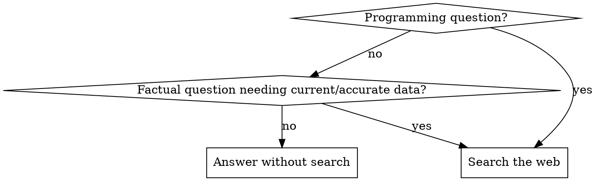

# Proactive Web Search

## Overview

**Search first, answer second.** For programming and factual questions, current information beats cached knowledge. The web has today's docs, your training has yesterday's.

**Priority: Programming questions ALWAYS search.** Factual questions search when accuracy matters. If you think a search could help, that is the trigger.

## When to Use

**Always search for (PROGRAMMING - highest priority):**
- Library/framework questions (React, Next.js, Vue, etc.)
- API documentation or usage patterns
- "Best practices" or "recommended approach" questions
- Version-specific questions (Next.js 15, Node 22, etc.)
- Error messages or debugging
- Security vulnerabilities or updates
- Tool configuration (TypeScript, Vite, Webpack, etc.)
- Tool capability discovery or command listing ("list skills", "show commands", "available subcommands")
- CLI/product usage questions outside the repo (opencode, gh, docker, etc.)

**Always search for (FACTUAL QUESTIONS):**
- Specific care requirements (plant watering, pet care, equipment maintenance)
- Medical/health information (symptoms, treatments, drug interactions)
- Current events or recent news
- Scientific data (measurements, specifications, chemical properties)
- Historical facts with dates/details
- Geographic/location information
- Product specifications or comparisons
- Legal requirements or regulations
- Statistical data or research findings
- "How to" questions requiring current best practices (non-programming)

**Search even when:**
- You "know" the answer from training data
- The topic seems stable or well-established
- Your knowledge cutoff is recent
- You're "pretty sure" nothing has changed
- You feel even 1% uncertainty or think a search could help
- You could check local help/docs but cannot run commands in this environment

**Narrow exceptions (skip search for):**
- Universal shell commands (`ls`, `cd`, `mkdir`, `cp`, `mv`)
- Core git operations (`git add`, `git commit`, `git push`, `git pull`)
- Basic package manager commands (`npm install`, `pip install`, `cargo build`)
- Fundamental language syntax (variable declaration, if statements, loops)

**BUT search even for exceptions if:**
- Question mentions specific versions or tools
- Question asks about configuration or options
- Question asks about integration with other systems
- Question asks about best practices or patterns

**Examples (Programming):**
- ❌ Don't search: "What's the git commit command?"
- ✅ Search: "What's the best way to structure git commits?"
- ❌ Don't search: "How do I declare a variable in Python?"
- ✅ Search: "What's the recommended type annotation pattern in Python?"
- ✅ Search: "How can I see the available skills in opencode?"

**Examples (Factual):**
- ✅ Search: "Tephrocactus typical watering requirements"
- ✅ Search: "What are the symptoms of vitamin D deficiency?"
- ✅ Search: "Current wildfires in California 2026"
- ❌ Don't search: "What is photosynthesis?" (General knowledge, not specific fact)
- ❌ Don't search: "How does gravity work?" (Conceptual, not specific data)

**Key distinction:** Search for **specific facts** (care requirements, current data, precise specifications). Skip search for **general concepts** or **philosophical questions**.

## Quick Reference

| Question Type | Search? | Example |
|---|---|---|
| Tool/CLI usage or discovery | Always | "list skills in opencode" |
| Library/API usage | Always | "React Server Components API" |
| Best practices | Always | "recommended git commit format" |
| Current facts/specs | Always | "vitamin D deficiency symptoms" |
| General concept | Usually no | "what is photosynthesis" |

## Red Flags - You're Rationalizing

These thoughts mean **STOP and search**:

| Rationalization | Reality |
|-----------------|---------|
| "My training data is sufficient" | Training data is historical. Web is current. |
| "Close to my cutoff date" | Ecosystems change weekly. Cutoff proximity is irrelevant. |
| "Stable specification/pattern" | Implementation details, tools, and best practices evolve constantly. |
| "I can mention it might have changed" | Disclaimers don't help. Current info does. Search. |
| "General best practices don't change" | They do. New security issues, performance patterns, and anti-patterns emerge. |
| "This would be valuable to search" | If you think it, DO it. Don't just acknowledge. |
| "I know general principles about X" | General principles ≠ specific facts. Search for specifics. |
| "Fits broader search criteria" | Don't rationalize. If it's factual with accuracy needs, just search. |
| "Local CLI help is authoritative" | Tool docs change; search to confirm current usage. |
| "This is environment-specific" | If you can't verify locally, search for current docs. |

**Red flags list:**
- "I can just use local help"
- "This is a simple tool question"
- "I'm mostly sure"

## The Rule



**If it's about code, libraries, tools, or technical practices: Search first.**

**If it's a specific fact where accuracy/currency matters: Search first.**

## Common Mistakes

### ❌ Relying on local CLI help instead of searching

```
"I'll just tell them to run opencode --help"
```

**Fix:** If the question is about tool usage or discovery, search first unless you can run the command yourself and verify output.

### ❌ Acknowledging Search Would Help, Then Not Searching

```
"I should search for this... but my training data includes X so I'll proceed..."
```

**Fix:** If you think search would help, you MUST search. No exceptions.

### ❌ Disclaiming Instead of Searching

```
"Based on my knowledge (which might be outdated)..."
"As of my last update..."
"Things may have changed..."
```

**Fix:** These disclaimers are worse than searching. They waste user time and signal you're guessing.

### ❌ Searching After Answering

```
[Gives long answer]
"Let me verify this with a search..."
```

**Fix:** Search BEFORE answering. Don't make users read outdated info first.

## Implementation

### Programming Question Pattern

```
User: "How do I implement X in Framework Y?"
You: [Immediately use WebSearch tool]
You: [Synthesize search results with code examples]
```

### Tool/CLI Usage Pattern

```
User: "How can I see the available skills in opencode?"
You: [Immediately use WebSearch tool]
You: [Provide current CLI commands or docs]
```

### Factual Question Pattern

```
User: "Tephrocactus typical watering requirements"
You: [Immediately use WebSearch tool]
You: [Provide specific care details with sources]
```

### Current Information Pattern

```
User: "What's the best approach for X in 2026?"
You: [Search for "X best practices 2026"]
You: [Provide current recommendations with sources]
```

## Real-World Impact

**Programming without this skill:** Agents provide outdated library APIs, deprecated patterns, and superseded best practices while acknowledging "things might have changed."

**Programming with this skill:** Agents search first, provide current information with security patches, and cite sources. Users get code that works vs code they have to fix.

**Factual questions without this skill:** Agents guess at specific requirements (plant care, medical dosages, specifications) from incomplete training data.

**Factual questions with this skill:** Agents search and provide accurate, current information with sources. Users get reliable data, not hallucinated guesses.
